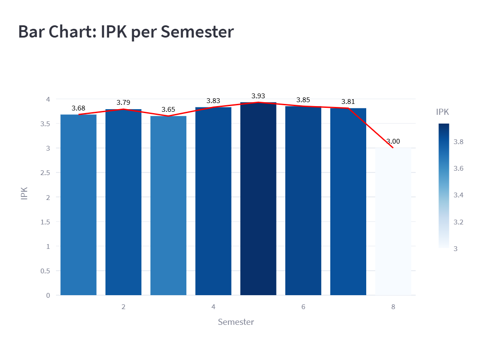
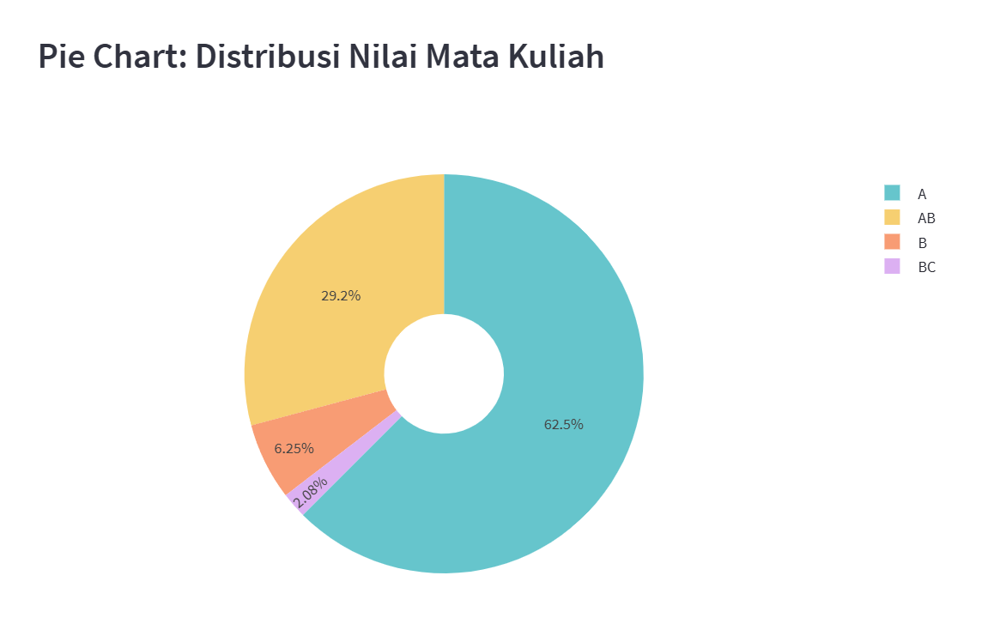

# Academic Performance Analysis

A **Streamlit-based web application** designed to analyze and visualize academic performance data from a college grades dataset (`grades.csv`). This project provides insights into cumulative GPA, semester-wise GPA trends, grade distribution, and course details, with a bilingual interface (Indonesian/English) for enhanced accessibility. Built with Python, Pandas, and Plotly, it showcases data processing, interactive visualizations, and robust error handling, making it a strong addition to a data science portfolio.

## Features
- **Cumulative GPA and Total Credits**: Displays overall academic performance with cumulative GPA and total credits earned.
- **Semester-wise GPA Bar Chart**: Visualizes GPA per semester with hover data for total credits, using Plotly for interactivity.
- **Grade Distribution Pie Chart**: Shows the proportion of grades achieved (A, AB, B, BC) from the dataset, with a note clarifying that only achieved grades are displayed.
- **Course Tables**: Interactive tables listing courses per semester and per grade, with expandable sections for detailed views.
- **Bilingual Interface**: Supports Indonesian and English languages for labels and messages, improving usability.
- **Data Validation**: Includes error handling for missing files, invalid grades (outside A, AB, B, BC, C, D, E), and non-numeric credits, ensuring robustness.

## Technologies Used
- **Python 3.8+**
- **Streamlit**: For building the interactive web application.
- **Pandas**: For data processing and analysis.
- **Plotly Express**: For creating interactive visualizations.
- **CSV**: Input data stored in `grades.csv`.

## Dataset
The `grades.csv` file contains academic data with the following columns:
- **Semester**: The semester number (1–8).
- **Kode Mata Kuliah**: Course code.
- **Mata Kuliah**: Course name (Indonesian).
- **Nama Mata Kuliah B. Inggris**: Course name (English).
- **SKS**: Credits earned for the course.
- **Nilai**: Grade received (A, AB, B, BC).

## Installation and Setup
1. Clone the repository:
   ```bash
   git clone https://github.com/arianz/academic-performance-analysis.git
   ```
2. Navigate to the project directory:
   ```bash
   cd academic-performance-analysis
   ```
3. Install dependencies:
   ```bash
   pip install -r requirements.txt
   ```
4. Run the Streamlit app:
   ```bash
   streamlit run app.py
   ```

## Requirements
See `requirements.txt` for dependencies:
```
streamlit==1.22.0
pandas==2.2.3
plotly==5.14.1
```

## Screenshots
| GPA Bar Chart | Grade Distribution Pie Chart |
|---------------|-----------------------------|
|  |  |
